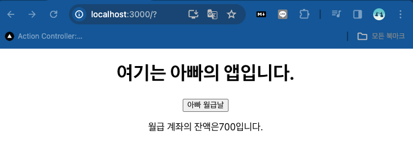
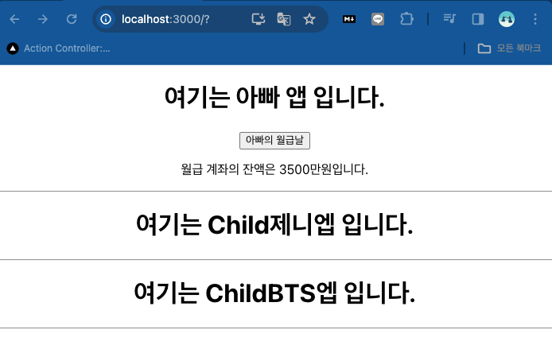
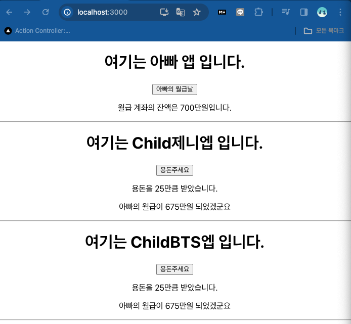

>    import {useState} from 'react';
    import './App.css';

    function App() {
    const[papamoney, setPapamoney] = useState(0);
    const getSalary =() => {
        setPapamoney(papamoney + 700);
    }
    return (
        

        <h1>여기는 아빠의 앱입니다.</h1>
        <button onClick={getSalary}>아빠 월급날</button> 
        
월급 계좌의 잔액은{papamoney}입니다.

            
        
        

    );
    }

    export default App;

>import {useState} from 'react';
import './App.css';

function Child(props) {
  const[papamoney, setPapamoney] = useState(0);
    return(
        

        <h1>여기는 Child{props.name}엡 입니다.</h1>
        

        
       
    ); 
  }    
function App(){
    const [papamoney, setPapamoney] = useState(0);
    const getSalary=()=>{
        setPapamoney(papamoney + 700);
    }
    return (
        <>
        

            <h1>여기는 아빠 앱 입니다.</h1>
            <button onClick={getSalary}>아빠의 월급날</button> 
            
월급 계좌의 잔액은 {papamoney}만원입니다. 
            
            

            <Child name="제니"/>
            <Child name="BTS"/>
        

        </>
        );
}
export default App;

>import {useState} from 'react';
import './App.css';
function Child(props) {

  const [papamoney, setPapamoney] = useState(0);
  const [money, setMoney] = useState(0);
  const getMoney = ()=>{
    setMoney(money + 5);
  }
    return(
        

        <h1>여기는 Child{props.name}엡 입니다.</h1>
        <button onClick={getMoney}>용돈주세요 </button>
        
용돈을 {money}만큼 받았습니다.

        
아빠의 월급이 {props.papamoney - money}만원 되었겠군요
  
        

        
       
    ); 
  }
   
function App(){
    const [papamoney, setPapamoney] = useState(0);
    const getSalary=()=>{
        setPapamoney(papamoney + 700);
    }

    return (
        
        

            <h1>여기는 아빠 앱 입니다.</h1>
            <button onClick={getSalary}>아빠의 월급날</button> 
            
월급 계좌의 잔액은 {papamoney}만원입니다. 
 
                   
            

            <Child papamoney = {papamoney} name="제니"/>
            <Child papamoney = {papamoney} name="BTS"/>
        
       
    );
}
export default App;
